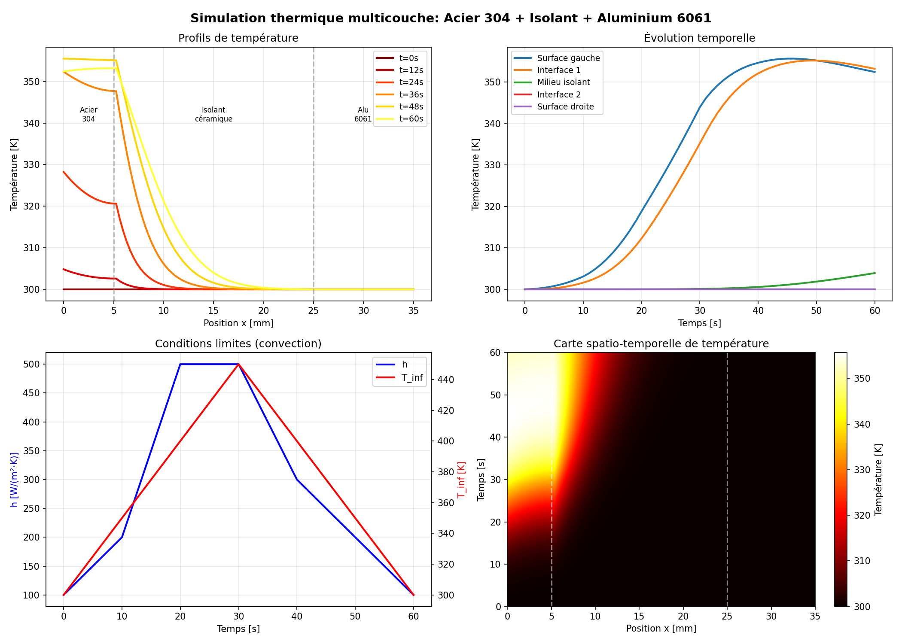

# 🔥 Solveur Thermique Multicouche 1D - Euler Implicite

[](https://www.python.org/)
[](https://numpy.org/)
[](LICENSE)

Un solveur de conduction thermique 1D transitoire pour milieux multicouches, basé sur un schéma aux différences finies implicite (Euler arrière), entièrement implémenté en Python/NumPy.



---

## 📋 Table des matières

- [Présentation](#-présentation)
- [Caractéristiques](#-caractéristiques)
- [Installation](#-installation)
- [Guide de démarrage rapide](#-guide-de-démarrage-rapide)
- [Tutoriel détaillé](#-tutoriel-détaillé)
- [Bibliothèque de matériaux](#-bibliothèque-de-matériaux)
- [Validation scientifique](#-validation-scientifique)
- [Structure du projet](#-structure-du-projet)
- [Théorie](#-théorie)
- [Références](#-références)

---

## 🎯 Présentation

Ce projet implémente un modèle numérique pour résoudre l'équation de la chaleur 1D dans des milieux multicouches :

$$\rho(T) \cdot c_p(T) \cdot \frac{\partial T}{\partial t} = \frac{\partial}{\partial x}\left[k(T) \cdot \frac{\partial T}{\partial x}\right]$$

### Applications typiques

- 🏗️ Isolation thermique des bâtiments
- 🔧 Traitement thermique des matériaux
- 🛡️ Protection thermique (aérospatial, industrie)
- 🔬 Caractérisation thermique de matériaux
- 📚 Enseignement du transfert thermique

---

## ✨ Caractéristiques

### Schéma numérique
- **Temporel** : Euler implicite (inconditionnellement stable)
- **Spatial** : Différences finies centrées (ordre 2)
- **Stabilité** : Aucune restriction sur le pas de temps (Fo >> 1 possible)

### Conditions limites supportées

| Type | Description | Formulation |
|------|-------------|-------------|
| **Dirichlet** | Température imposée | `T(x=0) = T_imposé` |
| **Neumann** | Flux imposé | `-k·∂T/∂x = q` |
| **Robin** | Convection | `-k·∂T/∂x = h·(T - T_∞)` |
| **Adiabatique** | Flux nul | `∂T/∂x = 0` |
| **Rayonnement** | Stefan-Boltzmann | `-k·∂T/∂x = σ·ε·(T⁴ - T_s⁴)` |
| **Convection + Rayonnement** | Combiné | `-k·∂T/∂x = h·(T - T_∞) + σ·ε·(T⁴ - T_s⁴)` |

### Fonctionnalités avancées
- ✅ Propriétés thermiques dépendantes de la température k(T), ρ(T), cp(T)
- ✅ Nombre arbitraire de couches
- ✅ Conditions limites variables dans le temps
- ✅ **Rayonnement thermique** avec l'environnement (loi de Stefan-Boltzmann)
- ✅ Bibliothèque de 44 matériaux avec données réelles
- ✅ Suite de tests de validation complète

---

## 📦 Installation

### Prérequis

- Python 3.8 ou supérieur
- NumPy
- Matplotlib
- SciPy (pour les tests de validation)

### Installation

```bash
# Cloner le dépôt
git clone https://github.com/Mirouxe/SOLVEUR-THERMIQUE-MULTICOUCHE-EULER-IMPLICITE-1D.git
cd SOLVEUR-THERMIQUE-MULTICOUCHE-EULER-IMPLICITE-1D

# Créer un environnement virtuel (recommandé)
python -m venv venv
source venv/bin/activate  # Linux/Mac
# ou: venv\Scripts\activate  # Windows

# Installer les dépendances
pip install numpy matplotlib scipy
```

---

## 🚀 Guide de démarrage rapide

### Exemple minimal

```python
from solver import ThermalSolver1D, create_constant_material, create_single_layer

# 1. Définir le matériau (acier)
material_data = create_constant_material(k=50, rho=7800, cp=500, name='steel')

# 2. Définir la géométrie (plaque de 10 cm)
layers = create_single_layer(L=0.1, material_name='steel')

# 3. Créer le solveur
solver = ThermalSolver1D(layers, material_data, Nx=101)

# 4. Définir les conditions limites
bc_left = lambda t: {'type': 'dirichlet', 'T': 500}  # T = 500 K à gauche
bc_right = lambda t: {'type': 'adiabatic'}           # Isolé à droite

# 5. Résoudre
result = solver.solve(T_init=300, t_end=100, dt=0.5, 
                      bc_left_func=bc_left, bc_right_func=bc_right)

# 6. Résultats
print(f"Température finale: {result['T'][-1].mean():.2f} K")
```

---

## 📖 Tutoriel détaillé

### 1. Comprendre la structure des données

#### Matériaux

Les propriétés thermiques sont définies sous forme de tables température-propriété :

```python
material_data = {
    'acier': {
        'T':   np.array([300, 400, 500, 600]),    # Températures [K]
        'k':   np.array([50, 45, 40, 35]),        # Conductivité [W/(m·K)]
        'rho': np.array([7800, 7800, 7800, 7800]),# Masse volumique [kg/m³]
        'cp':  np.array([500, 550, 600, 650])     # Capacité thermique [J/(kg·K)]
    }
}
```

Le solveur interpole automatiquement les propriétés à la température locale.

#### Couches

La géométrie est définie comme une liste de couches :

```python
layers = [
    {'material': 'acier', 'thickness': 0.005},      # 5 mm d'acier
    {'material': 'isolant', 'thickness': 0.020},    # 20 mm d'isolant
    {'material': 'aluminium', 'thickness': 0.010}   # 10 mm d'aluminium
]
```

### 2. Utiliser la bibliothèque de matériaux

```python
from material_library import get_material, get_materials, MaterialLibrary

# Lister tous les matériaux disponibles
MaterialLibrary.list_materials()

# Obtenir un matériau
steel = get_material('steel_304')

# Obtenir plusieurs matériaux
materials = get_materials('steel_304', 'ceramic_fiber', 'aluminum_6061')

# Voir les propriétés détaillées
MaterialLibrary.get_material_info('steel_304')

# Obtenir les propriétés à une température spécifique
k, rho, cp = MaterialLibrary.get_properties('steel_304', T=500)
print(f"À 500 K: k={k:.1f} W/(m·K), ρ={rho:.0f} kg/m³, cp={cp:.0f} J/(kg·K)")
```

### 3. Définir les conditions limites

#### Température imposée (Dirichlet)

```python
bc = lambda t: {'type': 'dirichlet', 'T': 500}  # T = 500 K constant
```

#### Flux imposé (Neumann)

```python
bc = lambda t: {'type': 'flux', 'q': 10000}  # q = 10 kW/m² entrant
```

#### Convection (Robin)

```python
bc = lambda t: {'type': 'convection', 'h': 500, 'T_inf': 400}
```

#### Adiabatique

```python
bc = lambda t: {'type': 'adiabatic'}
```

#### Rayonnement (Stefan-Boltzmann)

Le flux radiatif est calculé selon la loi de Stefan-Boltzmann :

$$q_{rad} = \sigma \cdot \varepsilon \cdot (T_{surface}^4 - T_{environnement}^4)$$

où σ = 5.67×10⁻⁸ W/(m²·K⁴) est la constante de Stefan-Boltzmann.

```python
# Rayonnement pur
bc = lambda t: {
    'type': 'radiation',
    'epsilon': 0.8,    # Émissivité de la surface (0 à 1)
    'T_s': 300         # Température de l'environnement [K]
}
```

#### Convection + Rayonnement combinés

Pour les applications haute température, il est courant de combiner convection et rayonnement :

```python
bc = lambda t: {
    'type': 'convection_radiation',
    'h': 50,           # Coefficient convectif [W/(m²·K)]
    'T_inf': 400,      # Température du fluide [K]
    'epsilon': 0.3,    # Émissivité
    'T_s': 350         # Température radiative de l'environnement [K]
}
```

#### Conditions variables dans le temps

```python
# Rampe de température
def bc_rampe(t):
    T_imposed = 300 + 10 * t  # Augmente de 10 K/s
    return {'type': 'dirichlet', 'T': min(T_imposed, 600)}

# Lecture depuis un fichier CSV (avec rayonnement)
data = np.loadtxt('flux.csv', delimiter=',', skiprows=1)
t_data = data[:, 0]
h_data = data[:, 1]
T_inf_data = data[:, 2]
T_s_data = data[:, 3]  # Température environnement pour rayonnement

def bc_from_csv(t):
    h = np.interp(t, t_data, h_data)
    T_inf = np.interp(t, t_data, T_inf_data)
    T_s = np.interp(t, t_data, T_s_data)
    return {
        'type': 'convection_radiation',
        'h': h, 'T_inf': T_inf,
        'epsilon': 0.3, 'T_s': T_s
    }
```

### 4. Lancer une simulation complète

```python
import numpy as np
import matplotlib.pyplot as plt
from solver import ThermalSolver1D
from material_library import get_materials

# Configuration
materials = get_materials('steel_304', 'rock_wool', 'aluminum_6061')

layers = [
    {'material': 'steel_304', 'thickness': 0.003},    # 3 mm
    {'material': 'rock_wool', 'thickness': 0.050},    # 50 mm
    {'material': 'aluminum_6061', 'thickness': 0.005} # 5 mm
]

# Créer le solveur
solver = ThermalSolver1D(layers, materials, Nx=101)

# Conditions limites
bc_left = lambda t: {'type': 'convection', 'h': 100, 'T_inf': 600}
bc_right = lambda t: {'type': 'convection', 'h': 10, 'T_inf': 300}

# Simulation
result = solver.solve(
    T_init=300,      # Température initiale [K]
    t_end=3600,      # Durée [s] (1 heure)
    dt=1.0,          # Pas de temps [s]
    bc_left_func=bc_left,
    bc_right_func=bc_right,
    save_every=60,   # Sauvegarder toutes les 60 s
    verbose=True     # Afficher la progression
)

# Visualisation
plt.figure(figsize=(10, 6))
for i in [0, len(result['time'])//4, len(result['time'])//2, -1]:
    plt.plot(result['x']*1000, result['T'][i], label=f"t = {result['time'][i]:.0f} s")

plt.xlabel('Position [mm]')
plt.ylabel('Température [K]')
plt.legend()
plt.grid(True)
plt.title('Évolution du profil de température')
plt.savefig('resultat.png', dpi=150)
plt.show()
```

### 5. Analyser les résultats

```python
# Accéder aux données
temps = result['time']          # Array des temps sauvegardés [s]
T = result['T']                 # Array 2D (n_temps, n_noeuds) [K]
x = result['x']                 # Positions des nœuds [m]

# Température en un point
idx_milieu = len(x) // 2
T_milieu = T[:, idx_milieu]
plt.plot(temps, T_milieu)
plt.xlabel('Temps [s]')
plt.ylabel('Température au milieu [K]')

# Flux de chaleur à la surface
k_surface = 14.9  # Conductivité de l'acier 304 [W/(m·K)]
dx = x[1] - x[0]
flux_surface = -k_surface * (T[:, 1] - T[:, 0]) / dx
print(f"Flux final: {flux_surface[-1]:.1f} W/m²")

# Énergie stockée
# E = ∫ ρ·cp·T dx
```

---

## 📚 Bibliothèque de matériaux

La bibliothèque contient **44 matériaux** avec propriétés dépendantes de la température :

### Métaux (19)
| Matériau | Clé | k [W/(m·K)] | Plage T [K] |
|----------|-----|-------------|-------------|
| Acier AISI 1010 | `steel_1010` | 27-64 | 300-1000 |
| Acier inox 304 | `steel_304` | 15-26 | 300-1000 |
| Aluminium 6061 | `aluminum_6061` | 167-193 | 300-600 |
| Cuivre pur | `copper_pure` | 351-401 | 300-1000 |
| Titane Ti-6Al-4V | `titanium_6al4v` | 7-14 | 300-800 |
| Inconel 718 | `inconel_718` | 11-26 | 300-1000 |

### Isolants (6)
| Matériau | Clé | k [W/(m·K)] | Plage T [K] |
|----------|-----|-------------|-------------|
| Laine de verre | `glass_wool` | 0.04-0.07 | 300-500 |
| Laine de roche | `rock_wool` | 0.04-0.11 | 300-700 |
| Fibre céramique | `ceramic_fiber` | 0.06-0.40 | 300-1300 |

### Céramiques (3)
| Matériau | Clé | k [W/(m·K)] | Plage T [K] |
|----------|-----|-------------|-------------|
| Alumine | `alumina` | 6-35 | 300-1200 |
| Zircone | `zirconia` | 2.0-2.2 | 300-1300 |

### Construction (8)
| Matériau | Clé | k [W/(m·K)] |
|----------|-----|-------------|
| Béton | `concrete` | 1.4 |
| Brique | `brick` | 0.7-0.8 |
| Verre | `glass` | 1.0-1.4 |

**Sources** : Engineering Toolbox, MatWeb, NIST, ASM Handbook

---

## ✅ Validation scientifique

Le solveur est validé par une suite de tests complète :

### Exécuter les tests

```bash
cd tests
python run_all_tests.py
```

### Résultats de validation

| Test | Description | Critère | Résultat |
|------|-------------|---------|----------|
| Solutions analytiques | Comparaison Carslaw & Jaeger | Erreur < 2% | ✅ |
| Convergence spatiale | Ordre du schéma spatial | Ordre > 1.5 | ✅ |
| Convergence temporelle | Ordre du schéma temporel | Ordre ~ 1 | ✅ |
| Stabilité | Fo jusqu'à 50 | Stable | ✅ |
| Conservation énergie | Système adiabatique | Variation < 0.5% | ✅ |
| Multicouche | Benchmark Mikhailov | Erreur < 1% | ✅ |

### Benchmark Mikhailov & Özişik

Comparaison avec la solution analytique pour une dalle composite 3 couches :

| Temps | Erreur L2 | Erreur relative |
|-------|-----------|-----------------|
| 1.0 s | 0.070 | 6.7% |
| 5.0 s | 0.006 | 0.6% |
| 20.0 s (final) | 0.006 | 0.6% |

---

## 📁 Structure du projet

```
SOLVEUR-THERMIQUE-MULTICOUCHE-EULER-IMPLICITE-1D/
│
├── solver.py                 # 🔧 Solveur principal
├── material_library.py       # 📚 Bibliothèque de 44 matériaux
├── exemple_simulation.py     # 📝 Exemple complet d'utilisation
├── flux.csv                  # 📊 Données de conditions limites
├── README.md                 # 📖 Documentation
│
├── tests/                    # ✅ Suite de validation
│   ├── run_all_tests.py
│   ├── analytical_solutions.py
│   ├── test_analytic_solution.py
│   ├── test_mesh_convergence.py
│   ├── test_time_convergence.py
│   ├── test_boundary_conditions.py
│   ├── test_temperature_dependent.py
│   └── test_multilayer.py
│
└── archive/                  # 📦 Code original
    └── modele_thermique.py
```

---

## 📐 Théorie

### Équation de la chaleur 1D

$$\rho c_p \frac{\partial T}{\partial t} = \frac{\partial}{\partial x}\left(k \frac{\partial T}{\partial x}\right)$$

### Discrétisation spatiale (différences finies centrées)

$$\frac{\partial}{\partial x}\left(k \frac{\partial T}{\partial x}\right) \approx \frac{1}{\Delta x^2}\left[k_{i+1/2}(T_{i+1} - T_i) - k_{i-1/2}(T_i - T_{i-1})\right]$$

### Schéma d'Euler implicite

$$\rho_i c_{p,i} \frac{T_i^{n+1} - T_i^n}{\Delta t} = \frac{k_{i+1/2}(T_{i+1}^{n+1} - T_i^{n+1}) - k_{i-1/2}(T_i^{n+1} - T_{i-1}^{n+1})}{\Delta x^2}$$

### Système linéaire

À chaque pas de temps, on résout : **A · T^(n+1) = b**

### Nombres adimensionnels

| Nombre | Définition | Signification |
|--------|------------|---------------|
| **Fourier** | Fo = αt/L² | Temps caractéristique de diffusion |
| **Biot** | Bi = hL/k | Rapport résistances convection/conduction |

- Fo >> 1 : Régime permanent atteint
- Bi << 0.1 : Température quasi-uniforme (lumped capacitance)
- Bi >> 1 : Résistance de convection négligeable

### Rayonnement thermique

Le flux radiatif échangé entre une surface et son environnement est donné par la loi de Stefan-Boltzmann :

$$q_{rad} = \sigma \cdot \varepsilon \cdot (T_{surface}^4 - T_{environnement}^4)$$

où :
- σ = 5.670374419×10⁻⁸ W/(m²·K⁴) est la constante de Stefan-Boltzmann
- ε est l'émissivité de la surface (0 ≤ ε ≤ 1)
- Les températures sont en Kelvin

#### Linéarisation pour le schéma implicite

Le terme radiatif étant non-linéaire (T⁴), on le linéarise autour de la température actuelle :

$$q_{rad} \approx h_{rad} \cdot (T_{eq} - T^{n+1})$$

avec le coefficient de transfert radiatif :

$$h_{rad} = 4 \cdot \sigma \cdot \varepsilon \cdot T^3$$

Cette linéarisation permet de conserver un système linéaire tout en capturant l'essentiel de la physique du rayonnement.

#### Valeurs typiques d'émissivité

| Surface | ε |
|---------|---|
| Corps noir idéal | 1.0 |
| Acier oxydé | 0.7 - 0.9 |
| Acier poli | 0.1 - 0.3 |
| Aluminium poli | 0.04 - 0.1 |
| Peinture noire | 0.9 - 0.98 |
| Béton | 0.85 - 0.95 |

---

## 📚 Références

1. **Carslaw, H.S. & Jaeger, J.C.** (1959). *Conduction of Heat in Solids*. Oxford University Press.

2. **Incropera, F.P. & DeWitt, D.P.** (2007). *Fundamentals of Heat and Mass Transfer*. Wiley.

3. **Özışık, M.N.** (1993). *Heat Conduction*. Wiley.

4. **Mikhailov, M.D. & Özışık, M.N.** (2003). *On transient heat conduction in a one-dimensional composite slab*. Int. J. Heat Mass Transfer.

5. **Engineering Toolbox** - https://www.engineeringtoolbox.com

6. **MatWeb** - http://www.matweb.com

---

## 📄 Licence

Ce projet est sous licence MIT - voir le fichier [LICENSE](LICENSE) pour plus de détails.

## 👤 Auteur

Développé par **Mirouxe** pour la simulation et validation de modèles thermiques numériques.

---

<p align="center">
  <i>Si ce projet vous est utile, n'hésitez pas à lui donner une ⭐ !</i>
</p>
